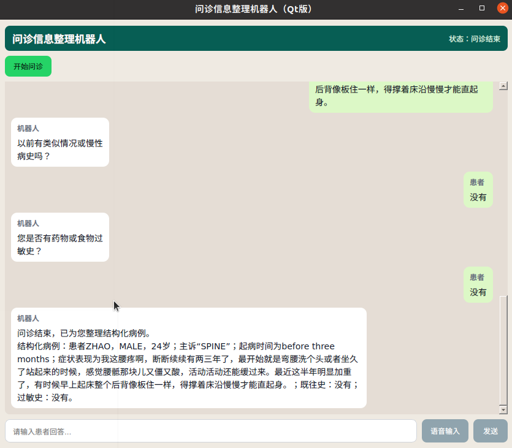

# 问诊信息整理机器人


一个纯 Python 的桌面 UI 项目（`Qt / PySide6`），用于演示问诊流程自动化：

- 点击开始问诊后，机器人按预设问题逐条提问。
- 聊天窗口样式接近即时通信软件（左机器人、右患者气泡）。
- 聊天窗口仅显示对话消息，不再额外显示回复面板。
- 患者输入框支持文字输入和语音输入（中文离线识别）。
- 所有问题完成后，自动输出一段结构化病例文字。

## 功能说明

1. **开始问诊**：创建新会话并返回第一条问题。
2. **问答循环**：每回答一条问题，返回下一条问题。
3. **聊天式 Qt UI 交互**：
   - 点击按钮开始问诊；
   - 使用聊天窗口输入患者回答并逐条提交；
   - 支持点击“语音输入”进行中文语音识别，识别结果会回填到输入框。
4. **结构化结果**：根据姓名、性别、年龄、主诉、起病时间、症状描述、既往史、过敏史，生成一段最终病例文本。

## 本地运行（Python 桌面版）

```bash
python3 -m venv .venv
source .venv/bin/activate
pip install -r requirements.txt
python app.py
```

## 中文语音模型（Vosk）

语音输入使用离线识别模型，请先下载中文模型并放到以下目录（默认路径）：

```bash
mkdir -p models
cd models
wget https://alphacephei.com/vosk/models/vosk-model-small-cn-0.22.zip
unzip vosk-model-small-cn-0.22.zip
```

最终应存在目录：`models/vosk-model-small-cn-0.22`

如果你想放到其他目录，可设置环境变量：

```bash
export VOSK_MODEL_PATH=/your/path/to/vosk-model-small-cn-0.22
```

## 项目结构

```text
.
├── app.py
└── requirements.txt
```

## 可扩展方向

- 把预设问题改为可配置表单（后台管理）。
- 接入数据库持久化问诊记录。
- 增加病种模板（儿科、内科、皮肤科等）。
- 对接大模型生成更专业的病历摘要。
